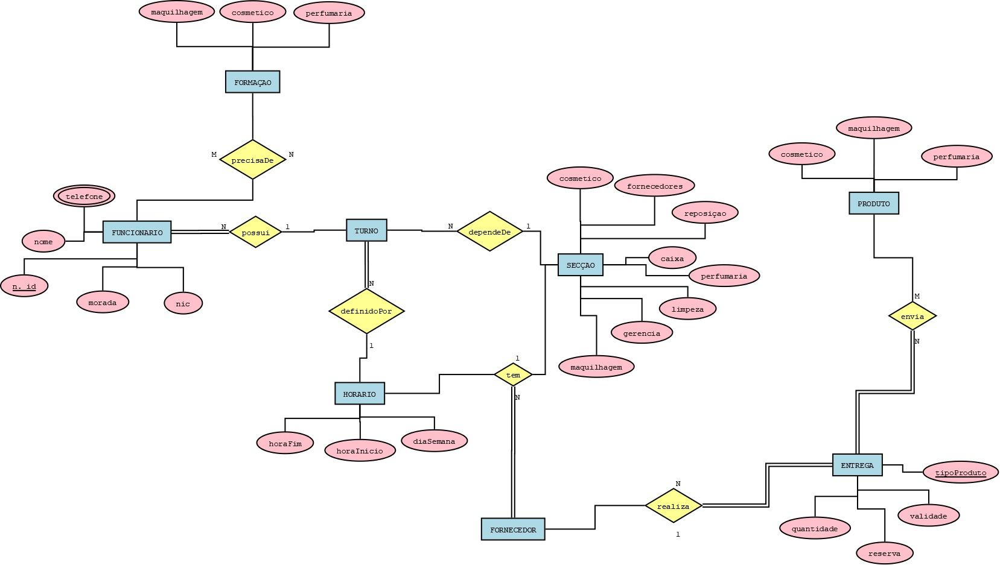

# C2 : Esquema conceptual

## Modelo E/A

### Entidades: 

FUNCIONARIO (nome, *telefone, morada, nic , _nidentificacao)

SECCAO (maquilhagem, cosmetico, perfumaria, caixa, reposicao, _gerencia, limpeza, fornecedor) 

FORNECEDOR (nome, _nid, tipostock, telefone*)

HORARIO (horafim, horainicio, diasemana)

ENTREGA (_tipoproduto, validade, reserva, quantidade)

PRODUTO (nome,tipoproduto,_codigoproduto,validade )

TURNO (partedia, hora)

FORMACAO (nome, _tipoformaçao)

### Associacoes:

possui (FUNCIONARIO,TURNO) N:1 T/P

precisaDe (FUNCIONARIO, FORMACAO) M:N P/P

dependeDe (TURNO, SECCAO) N:1 P/P

definidoPor (TURNO, HORARIO) N:1 T/P

tem (FORNECEDOR, SECCAO , HORARIO ) N:1:1 T/P/P

envia (ENTREGA, PRODUTO) M:N P/T

realiza (FORNECEDOR, ENTREGA) 1:N P/T

### Diagrama 

## Regras de negócio adicionais (Restrições)

Só poderá trabalhar nas secções da maquilhagem, cosméticos e perfumaria quem possuir uma formação especializada na área da cosmética. 

Não pode existir troca de turnos entre funcionários. 

Apenas gerentes podem receber entregas. 

O gerente deve fazer uma análise mensal relativamente ás vendas efectuadas em cada mês. 

[< Previous](rebd01.md) | [^ Main](https://github.com/tcm21-SIBD01/reportSIBD01) | [Next >](rebd03.md)
:--- | :---: | ---: 
