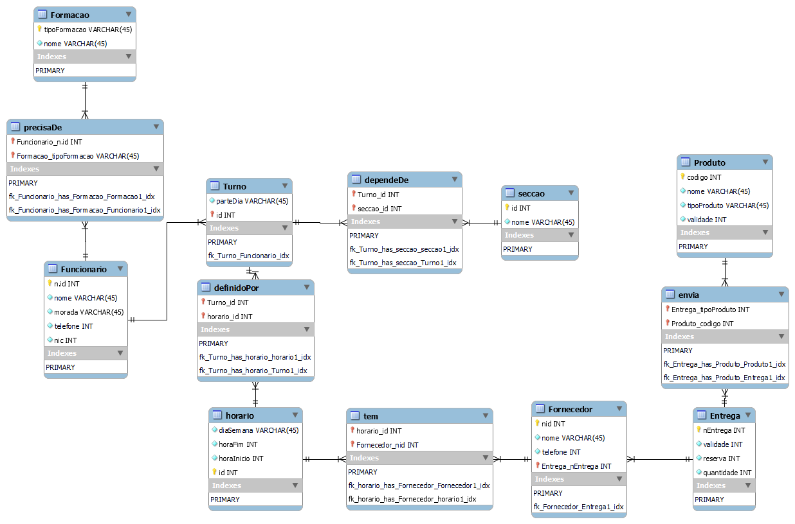

# C4 : Esquema Relacional  <!-- omit in toc -->

## Relações

### Tabelas 

##### Descrição das tabelas: 

| **Nome** | **Descrição** |
| --- | --- |
| **Formacao** | Informação sobre a formação | 
| **precisaDe** | O funcionário precisa de ter formação para trabalhar em algumas secções. | 
| **Funcionários** | Informaçoes sobre os funcionarios. | 
| **Turno** | Informações sobre o turno. |
| **definidoPor** | O turno é definido pelo horário. | 
| **horario** |Informações sobre o horário. | 
| **dependeDe** | O turno depende da secção em que trabalha. | 
| **tem** | os fornecedores tem um horário. | 
| **secção** |Informações sobre as secções. | 
| **Fornecedor** |Informações sobre os fornecedores. | 
| **Produto** |Informações sobre os produtos. | 
| **envia** |A entrega envia o produto. | 
| **Entrega** |Informações sobre as entregas. | 
  

## Vistas

Não existem. 

---
| [< Previous](rebd03.md) | [^ Main](https://github.com/exemploTrabalho/reportSIBD/) | [Next >](rebd05.md) |
| :---------------------- | :------------------------------------------------------: | ------------------: |
