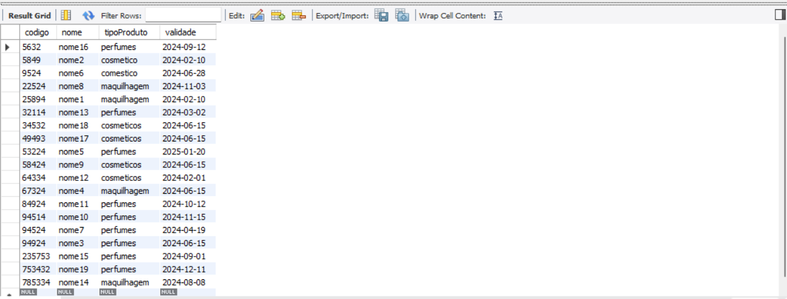

# C3 : SQL

## DDL


```sql

CREATE SCHEMA IF NOT EXISTS `NaturalBeauty`;

CREATE TABLE IF NOT EXISTS `NaturalBeauty`.`horario` (
`diaSemana` VARCHAR(45) NOT NULL,
`horaFim` INT NOT NULL,
`horaInicio` INT NOT NULL,
`id` INT NOT NULL AUTO_INCREMENT,
PRIMARY KEY (`id`));

CREATE TABLE IF NOT EXISTS `NaturalBeauty`.`funcionario` (
`n.id` INT NOT NULL AUTO_INCREMENT,
`nome` VARCHAR(45) NOT NULL,
`morada` VARCHAR(45) NOT NULL,
`telefone` INT NOT NULL,
`nic` INT NOT NULL,
PRIMARY KEY (`n.id`));

CREATE TABLE IF NOT EXISTS `NaturalBeauty`.`turno` (
`parteDia` VARCHAR(45) NOT NULL,
`id` INT NOT NULL AUTO_INCREMENT,
PRIMARY KEY (`id`),
INDEX `fk_Turno_Funcionario_idx` (`id` ASC),
CONSTRAINT `fk_Turno_Funcionario`
FOREIGN KEY (`id`)
REFERENCES `NaturalBeauty`.`funcionario` (`n.id`));

CREATE TABLE IF NOT EXISTS `NaturalBeauty`.`definidopor` (
`Turno_id` INT NOT NULL,
`horario_id` INT NOT NULL,
PRIMARY KEY (`Turno_id`, `horario_id`),
INDEX `fk_Turno_has_horario_horario1_idx` (`horario_id` ASC),

INDEX `fk_Turno_has_horario_Turno1_idx` (`Turno_id` ASC),
CONSTRAINT `fk_Turno_has_horario_horario1`
FOREIGN KEY (`horario_id`)
REFERENCES `NaturalBeauty`.`horario` (`id`),
CONSTRAINT `fk_Turno_has_horario_Turno1`
FOREIGN KEY (`Turno_id`)
REFERENCES `NaturalBeauty`.`turno` (`id`));

CREATE TABLE IF NOT EXISTS `NaturalBeauty`.`seccao` (
`id` INT NOT NULL AUTO_INCREMENT,
`nome` VARCHAR(45) NOT NULL,
PRIMARY KEY (`id`));

CREATE TABLE IF NOT EXISTS `NaturalBeauty`.`dependede` (
`Turno_id` INT NOT NULL,
`seccao_id` INT NOT NULL,
PRIMARY KEY (`Turno_id`, `seccao_id`),
INDEX `fk_Turno_has_seccao_seccao1_idx` (`seccao_id` ASC),
INDEX `fk_Turno_has_seccao_Turno1_idx` (`Turno_id` ASC),
CONSTRAINT `fk_Turno_has_seccao_seccao1`
FOREIGN KEY (`seccao_id`)
REFERENCES `NaturalBeauty`.`seccao` (`id`),
CONSTRAINT `fk_Turno_has_seccao_Turno1`
FOREIGN KEY (`Turno_id`)
REFERENCES `NaturalBeauty`.`turno` (`id`));

CREATE TABLE IF NOT EXISTS `NaturalBeauty`.`entrega` (
`nEntrega` INT NOT NULL AUTO_INCREMENT,
`validade` DATE NOT NULL,
`reserva` INT NOT NULL,
`quantidade` INT NOT NULL,
PRIMARY KEY (`nEntrega`));

CREATE TABLE IF NOT EXISTS `NaturalBeauty`.`produto` (
`codigo` INT NOT NULL AUTO_INCREMENT,
`nome` VARCHAR(45) NOT NULL,
`tipoProduto` VARCHAR(45) NOT NULL,
`validade` DATE NOT NULL,
PRIMARY KEY (`codigo`));

CREATE TABLE IF NOT EXISTS `NaturalBeauty`.`envia` (
`Entrega_tipoProduto` INT NOT NULL,
`Produto_codigo` INT NOT NULL,
PRIMARY KEY (`Entrega_tipoProduto`, `Produto_codigo`),
INDEX `fk_Entrega_has_Produto_Produto1_idx` (`Produto_codigo` ASC),
INDEX `fk_Entrega_has_Produto_Entrega1_idx` (`Entrega_tipoProduto` ASC),
CONSTRAINT `fk_Entrega_has_Produto_Entrega1`
FOREIGN KEY (`Entrega_tipoProduto`)
REFERENCES `NaturalBeauty`.`entrega` (`nEntrega`),
CONSTRAINT `fk_Entrega_has_Produto_Produto1`
FOREIGN KEY (`Produto_codigo`)
REFERENCES `NaturalBeauty`.`produto` (`codigo`));

CREATE TABLE IF NOT EXISTS `NaturalBeauty`.`formacao` (
`tipoFormacao` VARCHAR(45) NOT NULL,
`nome` VARCHAR(45) NOT NULL,
PRIMARY KEY (`tipoFormacao`));

CREATE TABLE IF NOT EXISTS `NaturalBeauty`.`fornecedor` (
`nid` INT NOT NULL AUTO_INCREMENT,
`nome` VARCHAR(45) NOT NULL,
`telefone` INT NOT NULL,
PRIMARY KEY (`nid`));

CREATE TABLE IF NOT EXISTS `NaturalBeauty`.`precisade` (
`Funcionario_n.id` INT NOT NULL,
`Formacao_tipoFormacao` VARCHAR(45) NOT NULL,
PRIMARY KEY (`Funcionario_n.id`, `Formacao_tipoFormacao`),
INDEX `fk_Funcionario_has_Formacao_Formacao1_idx` (`Formacao_tipoFormacao` ASC),
INDEX `fk_Funcionario_has_Formacao_Funcionario1_idx` (`Funcionario_n.id` ASC),
CONSTRAINT `fk_Funcionario_has_Formacao_Formacao1`
FOREIGN KEY (`Formacao_tipoFormacao`)
REFERENCES `NaturalBeauty`.`formacao` (`tipoFormacao`),
CONSTRAINT `fk_Funcionario_has_Formacao_Funcionario1`
FOREIGN KEY (`Funcionario_n.id`)
REFERENCES `NaturalBeauty`.`funcionario` (`n.id`));

CREATE TABLE IF NOT EXISTS `NaturalBeauty`.`tem` (
`horario_id` INT NOT NULL,
`Fornecedor_nid` INT NOT NULL,
PRIMARY KEY (`horario_id`, `Fornecedor_nid`),
INDEX `fk_horario_has_Fornecedor_Fornecedor1_idx` (`Fornecedor_nid` ASC),
INDEX `fk_horario_has_Fornecedor_horario1_idx` (`horario_id` ASC),
CONSTRAINT `fk_horario_has_Fornecedor_Fornecedor1`
FOREIGN KEY (`Fornecedor_nid`)
REFERENCES `NaturalBeauty`.`fornecedor` (`nid`),
CONSTRAINT `fk_horario_has_Fornecedor_horario1`
FOREIGN KEY (`horario_id`)
REFERENCES `NaturalBeauty`.`horario` (`id`));

```


## DML

Em baixo apresentamos alguns dados inseridos em cada uma das colunas com uma respetiva print do mesmo no mysql.

### funcionario

```sql
INSERT INTO naturalbeauty.funcionario VALUES ('1', 'Ana Sousa', 'morada1', '960000001', '100000001');
INSERT INTO naturalbeauty.funcionario VALUES ('2', 'Tania Fonseca', 'morada2', '960000002', '100000002');
INSERT INTO naturalbeauty.funcionario VALUES ('3', 'Teresa Moreira', 'morada3', '960000003', '100000003');
INSERT INTO naturalbeauty.funcionario VALUES ('4', 'Rita Vaz', 'morada4', '960000004', '100000004');
INSERT INTO naturalbeauty.funcionario VALUES ('5', 'Joao Silva', 'morada5', '960000005', '100000005');
INSERT INTO naturalbeauty.funcionario VALUES ('6', 'Fabio Vieira', 'morada6', '960000006', '100000006');
INSERT INTO naturalbeauty.funcionario VALUES ('7', 'Joana Lamelas', 'morada7', '960000007', '100000007');
INSERT INTO naturalbeauty.funcionario VALUES ('8', 'Claudio Santos', 'morada8', '960000008', '100000008');
INSERT INTO naturalbeauty.funcionario VALUES ('9', 'Juliana Bastos', 'morada9', '960000009', '100000009');
INSERT INTO naturalbeauty.funcionario VALUES ('10', 'Isabel Costa', 'morada10', '960000010', '100000010');
INSERT INTO naturalbeauty.funcionario VALUES ('11', 'Liliana Campos', 'morada11', '960000011', '100000011');
INSERT INTO naturalbeauty.funcionario VALUES ('12', 'Elisabete fernandes', 'morada12', '960000012', '100000012');
INSERT INTO naturalbeauty.funcionario VALUES ('13', 'Filipa Cunha', 'morada13', '960000013', '100000013');
INSERT INTO naturalbeauty.funcionario VALUES ('14', 'Luisa Sampaio', 'morada14', '960000014', '100000014');
INSERT INTO naturalbeauty.funcionario VALUES ('15', 'Joana Barbosa', 'morada15', '960000015', '100000015');
INSERT INTO naturalbeauty.funcionario VALUES ('16', 'Pedro Golcalves', 'morada16', '960000016', '100000016');
```
```sql
SELECT * FROM naturalbeauty.funcionario
```


### seccao

```sql
INSERT INTO naturalbeauty.seccao VALUES ('1', 'maquilhagem');
INSERT INTO naturalbeauty.seccao VALUES ('2', 'cosmeticos');
INSERT INTO naturalbeauty.seccao VALUES ('3', 'perfumaria');
INSERT INTO naturalbeauty.seccao VALUES ('4', 'caixa');
INSERT INTO naturalbeauty.seccao VALUES ('5', 'reposicao');
INSERT INTO naturalbeauty.seccao VALUES ('6', 'gerencia');
INSERT INTO naturalbeauty.seccao VALUES ('7', 'limpeza');
INSERT INTO naturalbeauty.seccao VALUES ('8', 'fornecedores');
```
```sql
SELECT * FROM naturalbeauty.seccao
```


### fornecedor

```sql
INSERT INTO naturalbeauty.fornecedor VALUES ('1', 'nome1', '253000001') ;
INSERT INTO naturalbeauty.fornecedor VALUES ('2', 'nome2', '253000002') ;
INSERT INTO naturalbeauty.fornecedor VALUES ('3', 'nome3', '253000003') ;
```
```sql
SELECT * FROM naturalbeauty.fornecedor
```


### horario

```sql
INSERT INTO naturalbeauty.horario VALUES ('segundafeira', '21', '10', '1');
INSERT INTO naturalbeauty.horario VALUES ('tercafeira', '21', '10', '2');
INSERT INTO naturalbeauty.horario VALUES ('quartafeira', '21', '10', '3');
INSERT INTO naturalbeauty.horario VALUES ('quintafeira', '21', '10', '4');
INSERT INTO naturalbeauty.horario VALUES ('sextafeira', '21', '10', '5');
INSERT INTO naturalbeauty.horario VALUES ('sabado', '18', '10', '6');
INSERT INTO naturalbeauty.horario VALUES ('domingo', '18', '10', '7');
```
```sql
SELECT * FROM naturalbeauty.horario
```


### entrega

```sql
INSERT INTO naturalbeauty.entrega VALUES('1', '2023-03-21', '45854833', '57');
INSERT INTO naturalbeauty.entrega VALUES('2', '2023-04-01', '45854564', '34');
INSERT INTO naturalbeauty.entrega VALUES('3', '2023-07-15', '45841693', '67');
```
```sql
SELECT * FROM naturalbeauty.entrega
```


### produto

```sql
INSERT INTO naturalbeauty.produto VALUES ('25894', 'nome1', 'maquilhagem', '2024-02-10');
INSERT INTO naturalbeauty.produto VALUES ('5849', 'nome2', 'cosmetico', '2024-02-10');
INSERT INTO naturalbeauty.produto VALUES ('94924', 'nome3', 'perfumes', '2024-06-15');
INSERT INTO naturalbeauty.produto VALUES ('67324', 'nome4', 'maquilhagem', '2024-06-15');
INSERT INTO naturalbeauty.produto VALUES ('53224', 'nome5', 'perfumes', '2025-01-20');
INSERT INTO naturalbeauty.produto VALUES ('9524', 'nome6', 'comestico', '2024-06-28');
INSERT INTO naturalbeauty.produto VALUES ('94524', 'nome7', 'perfumes', '2024-04-19');
INSERT INTO naturalbeauty.produto VALUES ('22524', 'nome8', 'maquilhagem', '2024-11-03');
INSERT INTO naturalbeauty.produto VALUES ('58424', 'nome9', 'cosmeticos', '2024-06-15');
INSERT INTO naturalbeauty.produto VALUES ('94514', 'nome10', 'perfumes', '2024-11-15');
INSERT INTO naturalbeauty.produto VALUES ('84924', 'nome11', 'perfumes', '2024-10-12');
INSERT INTO naturalbeauty.produto VALUES ('64334', 'nome12', 'cosmeticos', '2024-02-01');
INSERT INTO naturalbeauty.produto VALUES ('32114', 'nome13', 'perfumes', '2024-03-02');
INSERT INTO naturalbeauty.produto VALUES ('785334', 'nome14', 'maquilhagem', '2024-08-08');
INSERT INTO naturalbeauty.produto VALUES ('235753', 'nome15', 'perfumes', '2024-09-01');
INSERT INTO naturalbeauty.produto VALUES ('5632', 'nome16', 'perfumes', '2024-09-12');
INSERT INTO naturalbeauty.produto VALUES ('49493', 'nome17', 'cosmeticos', '2024-06-15');
INSERT INTO naturalbeauty.produto VALUES ('34532', 'nome18', 'cosmeticos', '2024-06-15');
INSERT INTO naturalbeauty.produto VALUES ('753432', 'nome19', 'perfumes', '2024-12-11');
```
```sql
SELECT * FROM naturalbeauty.produto
```


### turno

```sql
INSERT INTO naturalbeauty.turno VALUES ('manha', '1');
INSERT INTO naturalbeauty.turno VALUES ('tarde', '2');
INSERT INTO naturalbeauty.turno VALUES ('tarde', '3');
INSERT INTO naturalbeauty.turno VALUES ('noite', '4');
INSERT INTO naturalbeauty.turno VALUES ('noite', '5');
```
```sql
SELECT * FROM naturalbeauty.turno
```


### formacao

```sql
INSERT INTO naturalbeauty.formacao VALUES ('maquilhagem', 'nome1');
INSERT INTO naturalbeauty.formacao VALUES ('cosmetica', 'nome2');
INSERT INTO naturalbeauty.formacao VALUES ('perfumaria', 'nome3');
```
```sql
SELECT * FROM naturalbeauty.formacao
```


---
[< Previous](rebd04.md) | [^ Main](https://github.com/exemploTrabalho/reportSIBD/) | Next >
:--- | :---: | ---: 
