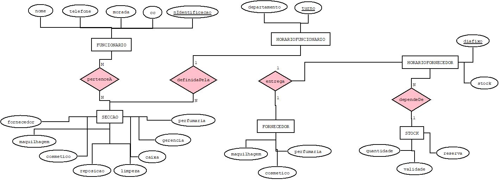

# C3 : Esquema conceptual

## Modelo E/A

### Entidades: 

FUNCIONARIO (nome, *telefone, morada, cc, _nidentificacao)

SECCAO (maquilhagem, cosmetico, perfumaria, caixa, reposiçao, gerencia, limpeza, fornecedores) 

FORNECEDOR (maquilhagem, comestico, perfumaria)

HORARIO (horafim, horainicio, diasemana)

????

PRODUTO (maquilhagem, cosmetico, perfumaria)

TURNO (manha, tarde, noite)

FORMACAO (maquilhagem, cosmetica, perfumaria)

SALARIO ( valor, mensal)

### Associacoes:

(FUNCIONARIO,TURNO)
(FUNCIONARIO, FORMACAO)
(TURNO, SECCAO)
(TURNO, HORARIO)
(FORNECEDOR, SECCAO)
(PRODUTO, ????)
(FORNECEDOR, ????)

pertenceA (FUNCIONARIO, SECCAO)                  M:N      T/P

definidoPela (HORARIO, SECÇAO)        1:N      T/P

dependeDe (STOCK,HORARIO)              N:1      P/T   

entrega (FORNECEDOR, HORARIO)          1:1      P/T

recebem (FUNCIONARIO, SALARIO)

### Diagrama: 

   

Diagrama do modelo Entidade-Associação

## Regras de negócio adicionais (Restrições)

Só poderá trabalhar nas secções da maquilhagem, cosméticos e perfumaria quem possuir uma formação especializada na área da cosmética. 

Não pode existir troca de turnos entre funcionários. 

Apenas gerentes podem receber entregas. 

---
[< Previous](rei02.md) | [^ Main](https://github.com/exemploTrabalho/reportSIBD01/) | Next >
