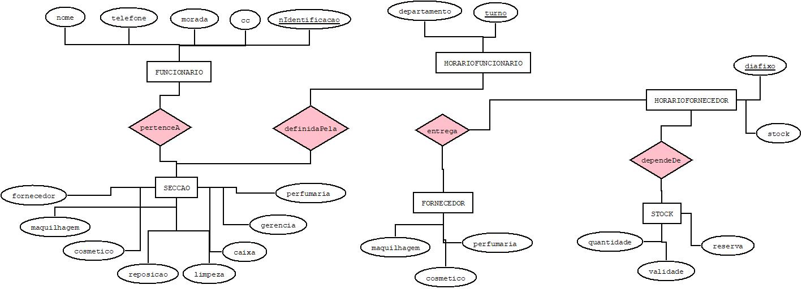

# C3 : Esquema conceptual

## Modelo E/A
Entidades: 

FUNCIONARIO (nome, telefone, morada, cc, nidentificacao)

SECCAO (maquilhagem, cosmetico, perfumaria, caixa, reposiçao, gerencia, limpeza, fornecedores) 

HORARIOFUNCIONARIO (departamento, turno)

FORNECEDOR (maquilhagem, comestico, perfumaria)

HORARIOFORNECEDOR (diafixo, stock) 

STOCK (quantidade, validade, reserva) 

Associacoes:

pertenceA (FUNCIONARIO, SECCAO)                  M:N      T/P

definidoPela (HORARIOFUNCIONARIO, SECÇAO)        1:N      T/P

dependeDe (STOCK,HORARIOFORNECEDOR)              N:1      P/T   

entrega (FORNECEDOR, HORARIOFORNECEDOR)          1:1      P/T

Diagrama: 

   

Diagrama do modelo Entidade-Associação

## Regras de negócio adicionais (Restrições)
_(Apresentar uma lista detalhada das regras e restrições não possíveis de representar no modelo E/A, que visam a manutenção da consistência e integridade da modelação do problema)_

---
[< Previous](rei02.md) | [^ Main](https://github.com/exemploTrabalho/reportSIBD/) | Next >
